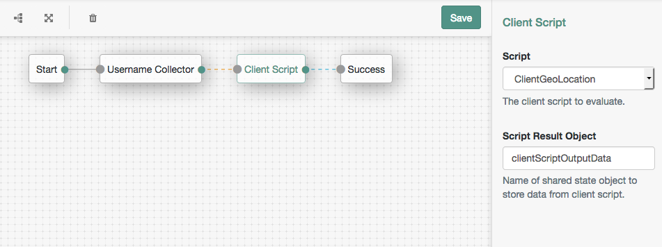
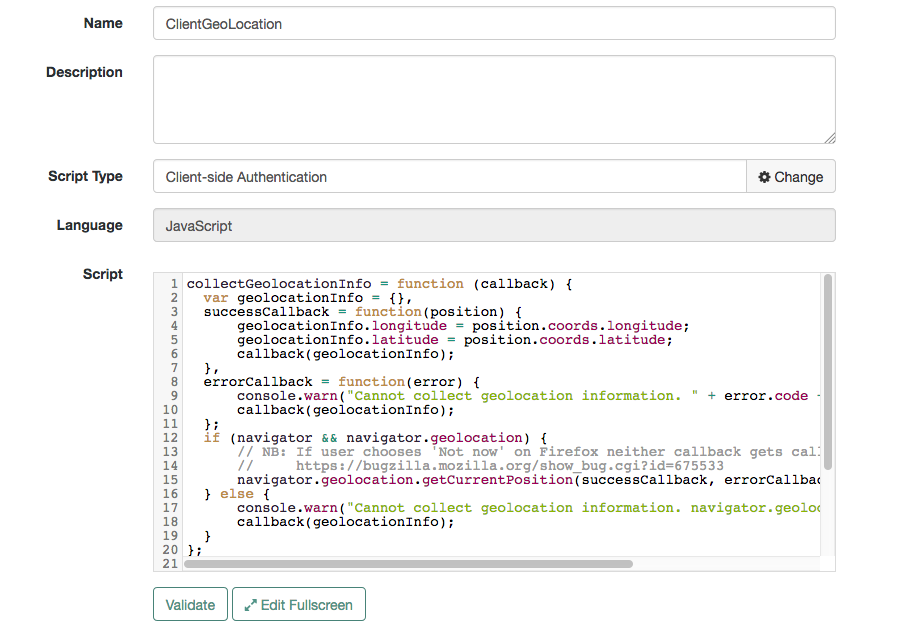

<!--
 * The contents of this file are subject to the terms of the Common Development and
 * Distribution License (the License). You may not use this file except in compliance with the
 * License.
 *
 * You can obtain a copy of the License at legal/CDDLv1.0.txt. See the License for the
 * specific language governing permission and limitations under the License.
 *
 * When distributing Covered Software, include this CDDL Header Notice in each file and include
 * the License file at legal/CDDLv1.0.txt. If applicable, add the following below the CDDL
 * Header, with the fields enclosed by brackets [] replaced by your own identifying
 * information: "Portions copyright [year] [name of copyright owner]".
 *
 * Copyright 2017 ForgeRock AS.
-->
# Client Script Authentication Node

A simple authentication node for ForgeRock's [Identity Platform][forgerock_platform] 5.5 and above. This node executes a client-side browser Javascript, returning any configured results to a shared state object. 
## Installation

Copy the .jar file from the ../target directory into the ../web-container/webapps/openam/WEB-INF/lib directory where AM is deployed.  Restart the web container to pick up the new node.  The node will then appear in the authentication trees components palette.

## Usage

Ensure that a valid client-side authentication script is defined (see below for example), then add this node to an authentication tree. In the node configuration select the client-side script, and specify the name of the shared state object to store any results output from the script.

## To Build

The code in this repository has binary dependencies that live in the ForgeRock maven repository. Maven can be configured to authenticate to this repository by following the following [ForgeRock Knowledge Base Article](https://backstage.forgerock.com/knowledge/kb/article/a74096897).

Edit the necessary ClientScriptNode.java as appropriate.  To rebuild, run "mvn clean install" in the directory containing the pom.xml  

  

## Client Script Configuration
  

  
<b>Example client script which gathers the browser geolocation and returns it as a JSON object:</b>

```javascript
collectGeolocationInfo = function (callback) {
  var geolocationInfo = {},
  successCallback = function(position) {
      geolocationInfo.longitude = position.coords.longitude;
      geolocationInfo.latitude = position.coords.latitude;
      callback(geolocationInfo);
  }, 
  errorCallback = function(error) {
      console.warn("Cannot collect geolocation information. " + error.code + ": " + error.message);
      callback(geolocationInfo);
  };
  if (navigator && navigator.geolocation) {
      // NB: If user chooses 'Not now' on Firefox neither callback gets called
      //     https://bugzilla.mozilla.org/show_bug.cgi?id=675533
      navigator.geolocation.getCurrentPosition(successCallback, errorCallback);
  } else {
      console.warn("Cannot collect geolocation information. navigator.geolocation is not defined.");
      callback(geolocationInfo);
  }
};

autoSubmitDelay = 30000;
console.log("DEBUG");
collectGeolocationInfo(function(geolocationInfo) {
    output.value = JSON.stringify(geolocationInfo);
    submit();
});
```

## Disclaimer
The sample code described herein is provided on an "as is" basis, without warranty of any kind, to the fullest extent permitted by law. ForgeRock does not warrant or guarantee the individual success developers may have in implementing the sample code on their development platforms or in production configurations.

ForgeRock does not warrant, guarantee or make any representations regarding the use, results of use, accuracy, timeliness or completeness of any data or information relating to the sample code. ForgeRock disclaims all warranties, expressed or implied, and in particular, disclaims all warranties of merchantability, and warranties related to the code, or any service or software related thereto.

ForgeRock shall not be liable for any direct, indirect or consequential damages or costs of any type arising out of any action taken by you or others related to the sample code.